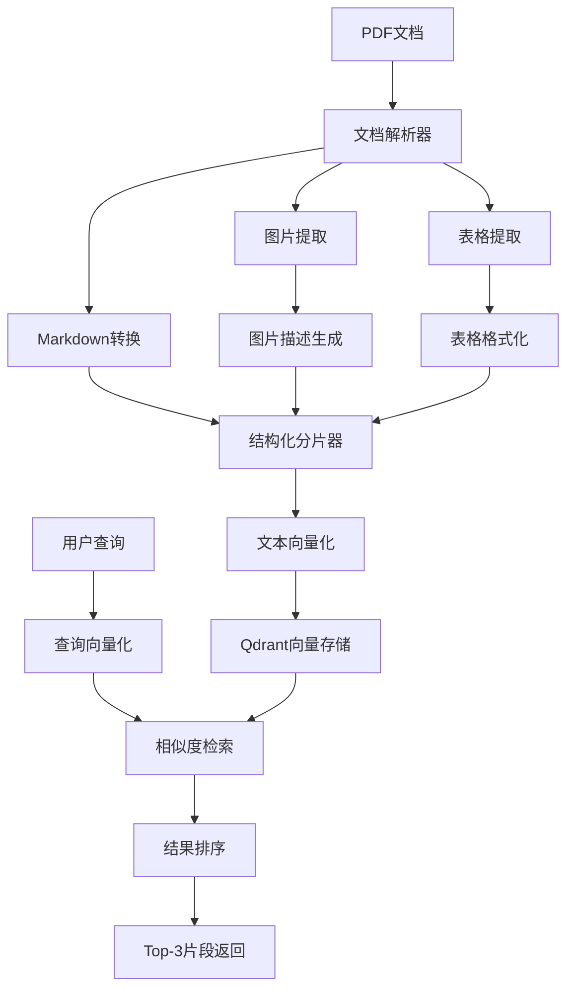

# 麒麟操作系统手册RAG检索系统技术方案

## 📋 项目概述

### 业务背景

基于**麒麟桌面操作系统操作手册**(7.7MB PDF文档)，构建智能文档检索系统，实现"用户提问→检索最相关文档片段"的核心流程。文档包含大量图表、表格和结构化内容，需要专门的多模态处理策略。

### 核心目标

- **文档理解**：准确解析包含图片、表格的PDF文档
- **语义检索**：基于用户提问返回top-3最相关文本片段
- **结构保留**：维持文档原有层级结构和语义完整性
- **中文优化**：针对中文文档特点进行优化

## 🔧 技术选型

### 核心技术栈

```text
PyMuPDF + pdfplumber (文档解析) 
    ↓
Markdown格式转换 (结构化存储)
    ↓
BGE-large-zh-v1.5 (中文向量化)
    ↓
Qdrant (向量数据库)
    ↓
LangChain (RAG框架)
```

### 技术选型对比

| 组件类型 | 选择方案 | 备选方案 | 选择理由 |
|---------|---------|---------|---------|
| **PDF解析** | PyMuPDF + pdfplumber | Unstructured, LayoutParser | 平衡性能与复杂度，中文支持优秀 |
| **向量模型** | BGE-large-zh-v1.5 | OpenAI Embeddings | 专门针对中文优化，本地部署 |
| **向量数据库** | Qdrant | FAISS, ChromaDB | 现代化设计，API友好，内存模式 |
| **RAG框架** | LangChain | 自实现 | 生态完整，快速开发 |

## 🏗️ 系统架构

### 整体架构图



### 数据流设计

```text
# 数据处理流程
PDF文档 (7.7MB)
├── 文本提取 → 结构化Markdown
├── 图片提取 → LLM描述 →  + 描述文本
└── 表格提取 → Markdown表格格式

↓ 
智能分片 (按层级 + RecursiveTextSplitter)
├── Chunk 1: 文本 + 元数据
├── Chunk 2: 表格 + 上下文
└── Chunk 3: 图片描述 + 引用

↓
向量化 (BGE-large-zh-v1.5, 1024维)
└── 存储到Qdrant Collection
```

## 🔍 核心组件设计

### 1. 多模态文档解析器

#### 1.1 PDF到Markdown转换

```python
class MultiModalPDFParser:
    def __init__(self):
        self.text_extractor = PyMuPDF()
        self.table_extractor = pdfplumber  
        self.image_extractor = PyMuPDF()
        
    def parse_to_markdown(self, pdf_path):
        """
        将PDF转换为结构化Markdown
        """
        result = {
            'markdown_content': '',
            'images': [],
            'tables': [],
            'metadata': {}
        }
        
        # 1. 提取文本结构
        text_blocks = self.extract_structured_text()
        
        # 2. 识别并提取表格
        tables = self.extract_tables()
        
        # 3. 提取并描述图片
        images = self.extract_and_describe_images()
        
        # 4. 合并为Markdown格式
        markdown = self.merge_to_markdown(text_blocks, tables, images)
        
        return result
```

#### 1.2 图片处理策略

```python
class ImageProcessor:
    def __init__(self):
        # 使用开源图片描述模型
        self.image_captioner = pipeline(
            "image-to-text", 
            model="Salesforce/blip2-opt-2.7b"
        )
    
    def process_image(self, image_data, page_num, image_index):
        """
        处理单张图片：保存 + 生成描述
        """
        # 1. 保存图片
        image_path = f"images/page_{page_num}_img_{image_index}.png"
        image_data.save(image_path)
        
        # 2. 生成描述
        description = self.image_captioner(image_data)[0]['generated_text']
        
        # 3. 返回Markdown格式
        return f"\n\n**图片描述**: {description}\n"
```

#### 1.3 表格处理策略

```python
class TableProcessor:
    def extract_table_to_markdown(self, table_data, context_before, context_after):
        """
        将表格转换为Markdown格式，保留上下文
        """
        # 1. 转换为Markdown表格
        markdown_table = self.dataframe_to_markdown(table_data)
        
        # 2. 添加上下文信息
        result = f"""
{context_before}

{markdown_table}

{context_after}
        """
        return result.strip()
```

### 2. 智能分片器

#### 2.1 混合分片策略

```python
class HybridChunker:
    def __init__(self):
        self.max_chunk_size = 500  # 中文字符
        self.overlap = 50
        self.preserve_elements = True
        
    def chunk_markdown(self, markdown_content):
        """
        混合分片策略：层级 + 递归
        """
        chunks = []
        
        # 1. 按标题层级预分割
        sections = self.split_by_headers(markdown_content)
        
        for section in sections:
            if self.is_oversized(section):
                # 大章节：递归分割，保持表格/图片完整
                sub_chunks = self.recursive_split_preserve_elements(section)
                chunks.extend(sub_chunks)
            else:
                # 小章节：直接作为一个chunk
                chunks.append(self.create_chunk(section))
                
        return chunks
    
    def recursive_split_preserve_elements(self, text):
        """
        递归分割，保护表格和图片不被截断
        """
        # 识别保护区域
        protected_ranges = self.find_protected_elements(text)
        
        # 在安全位置分割
        return self.safe_split(text, protected_ranges)
```

#### 2.2 元数据设计

```python
class ChunkMetadata:
    """
    丰富的chunk元数据设计
    """
    def create_metadata(self, chunk_content, section_info):
        return {
            "chunk_id": f"section_{section_info.level}_{section_info.index}",
            "section_hierarchy": section_info.hierarchy,  # ["1", "1.2", "1.2.1"]
            "section_title": section_info.title,
            "parent_section": section_info.parent,
            "page_range": [section_info.start_page, section_info.end_page],
            "content_types": self.analyze_content_types(chunk_content),
            "element_counts": {
                "tables": self.count_tables(chunk_content),
                "images": self.count_images(chunk_content),
                "text_length": len(chunk_content)
            },
            "cross_references": self.extract_references(chunk_content),
            "keywords": self.extract_keywords(chunk_content)
        }
```

### 3. 向量检索器

#### 3.1 Qdrant集成

```python
class QdrantRetriever:
    def __init__(self):
        self.client = QdrantClient(":memory:")  # 内存模式
        self.collection_name = "kylinos_docs"
        
    def setup_collection(self):
        """
        创建向量集合
        """
        self.client.create_collection(
            collection_name=self.collection_name,
            vectors_config=models.VectorParams(
                size=1024,  # BGE模型维度
                distance=models.Distance.COSINE
            )
        )
    
    def add_documents(self, chunks):
        """
        批量添加文档块
        """
        points = []
        for i, chunk in enumerate(chunks):
            points.append(models.PointStruct(
                id=i,
                vector=chunk.embedding,
                payload={
                    "content": chunk.content,
                    "metadata": chunk.metadata
                }
            ))
        
        self.client.upsert(
            collection_name=self.collection_name,
            points=points
        )
    
    def search(self, query_embedding, top_k=3):
        """
        相似度检索
        """
        search_result = self.client.search(
            collection_name=self.collection_name,
            query_vector=query_embedding,
            limit=top_k,
            with_payload=True
        )
        
        return [
            {
                "content": hit.payload["content"],
                "metadata": hit.payload["metadata"], 
                "score": hit.score
            }
            for hit in search_result
        ]
```

#### 3.2 混合检索策略

```python
class HybridSearchEngine:
    def __init__(self):
        self.vector_retriever = QdrantRetriever()
        self.keyword_retriever = BM25Retriever()  # 关键词检索
        
    def search(self, query, top_k=3):
        """
        多策略融合检索
        """
        # 1. 向量检索
        vector_results = self.vector_retriever.search(query, top_k*2)
        
        # 2. 关键词检索（特别适合表格内容）
        keyword_results = self.keyword_retriever.search(query, top_k*2)
        
        # 3. 结果融合与重排序
        final_results = self.rank_fusion(vector_results, keyword_results)
        
        return final_results[:top_k]
```

## ⚠️ 风险与挑战

### 主要风险

1. **PDF解析准确性**
   - 复杂布局可能导致文本顺序错乱
   - 表格识别可能不完整
   - **缓解方案**：实现质量检查机制

2. **分片大小不均匀**
   - 包含大表格的chunk可能过大
   - **缓解方案**：实现动态大小调整

3. **跨章节语义关联丢失**
   - 相关内容可能被分割到不同chunk
   - **缓解方案**：增加cross-reference元数据

4. **中文向量化效果**
   - 专业术语向量化可能不准确
   - **缓解方案**：领域词典预处理

### 性能考虑

- **内存使用**：BGE模型约1.3GB，Qdrant内存存储适中
- **处理速度**：7.7MB PDF预计处理时间2-3分钟
- **检索延迟**：单次查询预计<100ms

## 📝 项目结构

```text
rag_kylinos/
├── src/
│   ├── parsers/
│   │   ├── pdf_parser.py          # PDF解析器
│   │   ├── image_processor.py     # 图片处理器
│   │   └── table_processor.py     # 表格处理器
│   ├── chunkers/
│   │   ├── hybrid_chunker.py      # 混合分片器
│   │   └── metadata_generator.py  # 元数据生成器
│   ├── retrievers/
│   │   ├── qdrant_retriever.py    # Qdrant检索器
│   │   └── hybrid_search.py       # 混合检索引擎
│   ├── embeddings/
│   │   └── bge_embedder.py        # BGE向量化器
│   └── utils/
│       ├── quality_checker.py     # 质量检查
│       └── markdown_utils.py      # Markdown工具
├── data/
│   ├── raw/
│   │   └── kylinos_handle_book.pdf
│   ├── processed/
│   │   ├── markdown/              # 转换后的markdown文件
│   │   ├── images/                # 提取的图片
│   │   └── chunks/                # 分片结果
├── tests/
├── requirements.txt
├── README.md
└── main.py                        # 主程序入口
```

## 💡 创新点总结

1. **结构化中间格式**：使用Markdown作为中间表示，平衡可读性和结构化
2. **多模态融合处理**：图片描述+表格结构化+文本的统一处理
3. **智能分片策略**：层级预分割+递归细分+元素保护的混合策略
4. **丰富元数据设计**：支持多维度检索和结果排序
5. **现代化技术栈**：Qdrant向量数据库+BGE中文模型的组合

## 🔚 总结

本方案采用现代化RAG技术栈，针对包含丰富图表的中文技术文档特点，设计了完整的多模态处理流程。通过Markdown中间格式、智能分片策略和混合检索引擎，实现高质量的文档检索系统。

**核心优势：**

- ✅ **中文优化**：专门针对中文文档和查询优化
- ✅ **结构保留**：维持文档层级结构和元素完整性  
- ✅ **多模态支持**：统一处理文本、图片、表格
- ✅ **现代化架构**：使用最新的向量数据库和embedding模型
- ✅ **可扩展设计**：便于后续功能扩展和性能优化

该方案在面试场景中展现了对RAG技术的深入理解，同时保证了实现的可行性和效果的可验证性。
