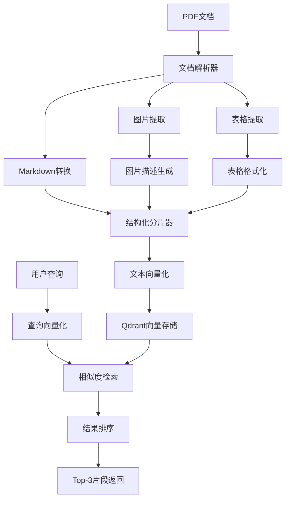

# 麒麟操作系统手册RAG检索系统技术方案

## 📋 项目概述

### 业务背景

基于**麒麟桌面操作系统操作手册**(7.7MB PDF文档)，构建智能文档检索系统，实现"用户提问→检索最相关文档片段"的核心流程。文档包含大量图表、表格和结构化内容，需要专门的多模态处理策略。

### 核心目标

- **文档理解**：准确解析包含图片、表格的PDF文档
- **语义检索**：基于用户提问返回top-3最相关文本片段
- **结构保留**：维持文档原有层级结构和语义完整性
- **中文优化**：针对中文文档特点进行优化

## 🔧 技术选型

### 核心技术栈

```text
PyMuPDF + pdfplumber (文档解析) 
    ↓
Markdown格式转换 (结构化存储)
    ↓
BGE-large-zh-v1.5 (中文向量化)
    ↓
Qdrant (向量数据库)
    ↓
LangChain (RAG框架)
```

### 技术选型对比

| 组件类型 | 选择方案 | 备选方案 | 选择理由 |
|---------|---------|---------|---------|
| **PDF解析** | PyMuPDF + pdfplumber | Unstructured, LayoutParser | 平衡性能与复杂度，中文支持优秀 |
| **向量模型** | BGE-large-zh-v1.5 | OpenAI Embeddings | 专门针对中文优化，本地部署 |
| **向量数据库** | Qdrant | FAISS, ChromaDB | 现代化设计，API友好，内存模式 |
| **RAG框架** | LangChain | 自实现 | 生态完整，快速开发 |

## 🏗️ 系统架构

### 整体架构图



### 数据流设计

```text
# 数据处理流程
PDF文档 (7.7MB)
├── 文本提取 → 结构化Markdown
├── 图片提取 → LLM描述 →  + 描述文本
└── 表格提取 → Markdown表格格式

↓ 
智能分片 (按层级 + RecursiveTextSplitter)
├── Chunk 1: 文本 + 元数据
├── Chunk 2: 表格 + 上下文
└── Chunk 3: 图片描述 + 引用

↓
向量化 (BGE-large-zh-v1.5, 1024维)
└── 存储到Qdrant Collection
```

## 🔍 核心组件设计


### 🔧 核心组件：RAGSystem主控制器

`rag_system.py`是整个系统的核心控制器，封装了完整的RAG流程：

```pseudocode
class RAGSystem:
    """
    RAG System Main Controller
    Encapsulates document processing and query workflow
    """
    
    function __init__(config):
        # Load configuration and initialize components
        load_config(config)
        init_components()
        setup_system_state()
    
    function process_document(pdf_path):
        """
        Complete document processing pipeline:
        Parse -> Chunk -> Vectorize -> Store
        """
        # 1. File validation
        validate_file(pdf_path)
        
        # 2. PDF parsing
        parsed_doc = parser.parse(pdf_path)
        
        # 3. Document chunking
        chunks = chunker.chunk(parsed_doc)
        
        # 4. Vectorization
        embeddings = embedder.embed([chunk.content for chunk in chunks])
        for chunk, embedding in zip(chunks, embeddings):
            chunk.embedding = embedding
        
        # 5. Store to vector database
        retriever.add_documents(chunks)
        
        # 6. Update system state
        update_system_state(chunks, pdf_path)
        
        return processing_statistics
    
    function query(question, top_k=3):
        """
        Query relevant document chunks
        """
        # 1. State validation
        validate_system_ready()
        
        # 2. Query vectorization
        query_embedding = embedder.embed([question])[0]
        
        # 3. Vector retrieval
        results = retriever.search(query_embedding, top_k)
        
        # 4. Post-processing
        filtered_results = post_process_results(results)
        
        return filtered_results
    
    # System management functions
    function get_system_info()
    function clear_database()
    function update_config(new_config)
```

#### 主要功能模块

1. **组件管理**
   - 自动初始化所有子组件（解析器、分片器、向量化器、检索器）
   - 配置验证和组件状态管理
   - 支持动态配置更新

2. **文档处理流程**
   - 文件验证和错误处理
   - 完整的处理管道：解析→分片→向量化→存储
   - 处理统计和性能监控

3. **查询接口**
   - 状态验证和参数校验
   - 查询向量化和相似度检索
   - 结果过滤和后处理

4. **系统状态管理**
   - 文档处理状态跟踪
   - 系统信息获取
   - 数据库清理和重置

### 1. 多模态文档解析器

#### 1.1 PDF到Markdown转换

```pseudocode
class MultiModalPDFParser:
    initialize():
        text_extractor = PyMuPDF_library
        table_extractor = pdfplumber_library  
        image_extractor = PyMuPDF_library
        
    function parse_to_markdown(pdf_path):
        """
        Convert PDF to structured Markdown
        """
        result = {
            'markdown_content': '',
            'images': [],
            'tables': [],
            'metadata': {}
        }
        
        # 1. Extract text structure
        text_blocks = extract_structured_text()
        
        # 2. Identify and extract tables
        tables = extract_tables()
        
        # 3. Extract and describe images
        images = extract_and_describe_images()
        
        # 4. Merge to Markdown format
        markdown = merge_to_markdown(text_blocks, tables, images)
        
        return result
```

#### 1.2 图片处理策略

```pseudocode
class ImageProcessor:
    initialize():
        # Use open-source image captioning model
        image_captioner = image_description_AI_model("Salesforce/blip2-opt-2.7b")
    
    function process_image(image_data, page_num, image_index):
        """
        Process single image: save + generate description
        """
        # 1. Save image
        image_path = f"images/page_{page_num}_img_{image_index}.png"
        image_data.save(image_path)
        
        # 2. Generate description
        description = image_captioner.generate_description(image_data)
        
        # 3. Return Markdown format
        return f"\n\n**Image Description**: {description}\n"
```

#### 1.3 表格处理策略

```pseudocode
class TableProcessor:
    function extract_table_to_markdown(table_data, context_before, context_after):
        """
        Convert table to Markdown format, preserve context
        """
        # 1. Convert to Markdown table
        markdown_table = convert_to_markdown_table(table_data)
        
        # 2. Add context information
        result = f"""
{context_before}

{markdown_table}

{context_after}
        """
        return result.strip()
```

### 2. 智能分片器

#### 2.1 混合分片策略

```pseudocode
class HybridChunker:
    initialize():
        max_chunk_size = 500  # Chinese characters
        overlap_size = 50
        preserve_elements = True
        
    function chunk_markdown(markdown_content):
        """
        Hybrid chunking strategy: hierarchical + recursive
        """
        chunks = []
        
        # 1. Pre-split by heading levels
        sections = split_by_headers(markdown_content)
        
        for section in sections:
            if is_oversized(section):
                # Large sections: recursive split, keep tables/images intact
                sub_chunks = recursive_split_preserve_elements(section)
                chunks.extend(sub_chunks)
            else:
                # Small sections: directly as one chunk
                chunks.append(create_chunk(section))
                
        return chunks
    
    function recursive_split_preserve_elements(text):
        """
        Recursive split, protect tables and images from truncation
        """
        # Identify protected areas
        protected_ranges = find_protected_elements(text)
        
        # Split at safe positions
        return safe_split(text, protected_ranges)
```

#### 2.2 元数据设计

```pseudocode
class ChunkMetadata:
    """
    Rich chunk metadata design
    """
    function create_metadata(chunk_content, section_info):
        return {
            "chunk_id": f"section_{section_info.level}_{section_info.index}",
            "section_hierarchy": section_info.hierarchy,  # ["1", "1.2", "1.2.1"]
            "section_title": section_info.title,
            "parent_section": section_info.parent,
            "page_range": [section_info.start_page, section_info.end_page],
            "content_types": analyze_content_types(chunk_content),
            "element_counts": {
                "tables": count_tables(chunk_content),
                "images": count_images(chunk_content),
                "text_length": len(chunk_content)
            },
            "cross_references": extract_references(chunk_content),
            "keywords": extract_keywords(chunk_content)
        }
```

### 3. 向量检索器

#### 3.1 Qdrant集成

```pseudocode
class QdrantRetriever:
    initialize():
        client = QdrantClient(":memory:")  # Memory mode
        collection_name = "kylinos_docs"
        
    function setup_collection():
        """
        Create vector collection
        """
        client.create_collection(
            collection_name=collection_name,
            vectors_config={
                size=1024,  # BGE model dimension
                distance=cosine_distance
            }
        )
    
    function add_documents(chunks):
        """
        Batch add document chunks
        """
        points = []
        for index, chunk in enumerate(chunks):
            points.append({
                id=index,
                vector=chunk.embedding,
                payload={
                    "content": chunk.content,
                    "metadata": chunk.metadata
                }
            })
        
        client.upsert(
            collection_name=collection_name,
            points=points
        )
    
    function search(query_vector, top_k=3):
        """
        Similarity retrieval
        """
        search_result = client.search(
            collection_name=collection_name,
            query_vector=query_vector,
            limit=top_k,
            with_payload=True
        )
        
        return [
            {
                "content": hit.payload["content"],
                "metadata": hit.payload["metadata"], 
                "score": hit.score
            }
            for hit in search_result
        ]
```

#### 3.2 混合检索策略

```pseudocode
class HybridSearchEngine:
    initialize():
        vector_retriever = QdrantRetriever()
        keyword_retriever = BM25Retriever()  # Keyword retrieval
        
    function search(query, top_k=3):
        """
        Multi-strategy fusion retrieval
        """
        # 1. Vector retrieval
        vector_results = vector_retriever.search(query, top_k*2)
        
        # 2. Keyword retrieval (especially suitable for table content)
        keyword_results = keyword_retriever.search(query, top_k*2)
        
        # 3. Result fusion and reranking
        final_results = rank_fusion(vector_results, keyword_results)
        
        return final_results[:top_k]
```

## ⚠️ 风险与挑战

### 主要风险

1. **PDF解析准确性**
   - 复杂布局可能导致文本顺序错乱
   - 表格识别可能不完整
   - **缓解方案**：实现质量检查机制

2. **分片大小不均匀**
   - 包含大表格的chunk可能过大
   - **缓解方案**：实现动态大小调整

3. **跨章节语义关联丢失**
   - 相关内容可能被分割到不同chunk
   - **缓解方案**：增加cross-reference元数据

4. **中文向量化效果**
   - 专业术语向量化可能不准确
   - **缓解方案**：领域词典预处理

### 性能考虑

- **内存使用**：BGE模型约1.3GB，Qdrant内存存储适中
- **处理速度**：7.7MB PDF预计处理时间2-3分钟
- **检索延迟**：单次查询预计<100ms

## 📝 项目结构

```text
rag_kylinos/
├── src/
│   ├── rag_system.py              # 🔧 RAG系统主控制器
│   ├── parsers/
│   │   ├── pdf_parser.py          # PDF解析器
│   │   ├── image_processor.py     # 图片处理器
│   │   └── table_processor.py     # 表格处理器
│   ├── chunkers/
│   │   ├── hybrid_chunker.py      # 混合分片器
│   │   └── metadata_generator.py  # 元数据生成器
│   ├── retrievers/
│   │   ├── qdrant_retriever.py    # Qdrant检索器
│   │   └── hybrid_search.py       # 混合检索引擎
│   ├── embeddings/
│   │   └── bge_embedder.py        # BGE向量化器
│   ├── model/
│   │   ├── document_models.py     # 文档数据模型
│   │   ├── search_models.py       # 检索结果模型
│   │   └── config_models.py       # 配置数据模型
│   ├── config.py                  # 配置管理
│   ├── exceptions.py              # 异常定义
│   └── utils/
│       ├── quality_checker.py     # 质量检查
│       └── markdown_utils.py      # Markdown工具
├── data/
│   ├── raw/
│   │   └── kylinos_handle_book.pdf
│   ├── processed/
│   │   ├── markdown/              # 转换后的markdown文件
│   │   ├── images/                # 提取的图片
│   │   └── chunks/                # 分片结果
├── tests/
├── requirements.txt
├── README.md
└── main.py                        # 主程序入口
```

## 💡 创新点总结

1. **结构化中间格式**：使用Markdown作为中间表示，平衡可读性和结构化
2. **多模态融合处理**：图片描述+表格结构化+文本的统一处理
3. **智能分片策略**：层级预分割+递归细分+元素保护的混合策略
4. **丰富元数据设计**：支持多维度检索和结果排序
5. **现代化技术栈**：Qdrant向量数据库+BGE中文模型的组合

## 🔚 总结

本方案采用现代化RAG技术栈，针对包含丰富图表的中文技术文档特点，设计了完整的多模态处理流程。通过Markdown中间格式、智能分片策略和混合检索引擎，实现高质量的文档检索系统。

**核心优势：**

- ✅ **中文优化**：专门针对中文文档和查询优化
- ✅ **结构保留**：维持文档层级结构和元素完整性  
- ✅ **多模态支持**：统一处理文本、图片、表格
- ✅ **现代化架构**：使用最新的向量数据库和embedding模型
- ✅ **可扩展设计**：便于后续功能扩展和性能优化

该方案在面试场景中展现了对RAG技术的深入理解，同时保证了实现的可行性和效果的可验证性。

## 📊 项目实现状态

### 已实现功能

- [x] RAG系统主控制器
- [x] 简单PDF文本解析器
- [x] 简单重叠分片器  
- [x] BGE中文向量化器
- [x] Qdrant向量存储
- [x] 向量相似度检索
- [x] CLI命令行界面
- [x] 配置管理系统
- [x] 测试套件

### 待实现功能

- [ ] 多模态PDF解析器（图片+表格）
- [ ] 图片描述生成器
- [ ] 智能表格提取
- [ ] 混合分片策略（层级+递归）
- [ ] 高级元数据生成
- [ ] BM25关键词检索
- [ ] 混合检索引擎
- [ ] 查询优化
- [ ] Web用户界面
- [ ] 性能优化
